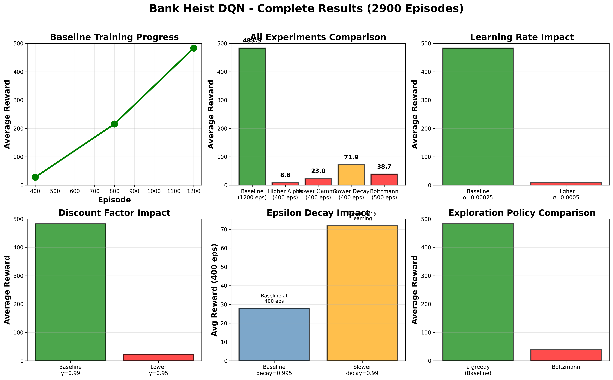

# Deep Q-Learning for Atari Bank Heist

An end-to-end Deep Q-Network (DQN) implementation that learns to play the Atari game Bank Heist from raw pixels. This project explores how tuning key hyperparameters (α, γ, ε) impacts learning stability, exploration, and long-term performance.

## Project Overview

A convolutional DQN agent was trained for ~2,900 episodes using the Gymnasium ALE environment.
Systematic experiments on learning rate, discount factor, exploration decay, and policy type reveal how subtle parameter changes reshape the agent’s behavior.

**Result:** The agent evolved from random movement to efficient, goal-directed navigation — learning to rob banks while avoiding capture through trial and error.

  
*Figure 1 — Training progress and hyperparameter comparison.*

## Key Findings

| Experiment | Configuration | Avg Reward | Observation |
|-------------|---------------|-------------|--------------|
| **Baseline** | α=0.00025, γ=0.99, ε-decay=0.995 | **483.3** | Stable convergence |
| ↑ Learning Rate | α=0.0005 | 8.8 | Diverged — unstable Q-values |
| ↓ Discount Factor | γ=0.95 | 23.0 | Myopic, short-sighted policy |
| ↓ Epsilon Decay | decay=0.99 | **71.9 (+158%)** | Best early-stage learning |
| Boltzmann Policy | Softmax w/ T-decay=0.995 | 38.7 | Moderate gain, unstable |

### Insights
**Slower epsilon decay (0.99 vs 0.995) achieved 2.6x better learning efficiency**, demonstrating that extended exploration significantly improves early-stage performance in complex navigation tasks.

## Architecture

### DQN Network
- **Input:** 4 stacked grayscale frames (84×84 pixels)
- **Architecture:** 
  - Conv2D(4→32, kernel=8, stride=4)
  - Conv2D(32→64, kernel=4, stride=2)
  - Conv2D(64→64, kernel=3, stride=1)
  - Fully Connected(3136→512)
  - Fully Connected(512→18)
- **Output:** Q-values for 18 discrete actions

### Key Components
- **Experience Replay:** 30,000 capacity buffer
- **Target Network:** Updated every 10 episodes
- **Batch Size:** 32 experiences
- **Optimizer:** Adam with learning rate 0.00025

## Training Details

### Environment Details
- **Game:** Bank Heist (ALE/BankHeist-v5)
- **State Space:** Continuous (84×84×4 stacked frames)
- **Action Space:** Discrete (18 actions)
- **Reward Structure:** Native game scoring (points for robbing banks)

### Baseline Configuration
```python
total_episodes = 1000
max_steps = 2000
learning_rate = 0.00025  # Alpha in Bellman equation
gamma = 0.99             # Discount factor
epsilon_start = 1.0
epsilon_min = 0.01
epsilon_decay = 0.995
batch_size = 32
memory_size = 30000
```

## Experiments Conducted

### Experiment 1: Learning Rate (Alpha)
- **Hypothesis:** Higher learning rate accelerates training
- **Configuration:** α = 0.0005 (2x baseline)
- **Result:** Failed (8.8 avg) - caused training instability
- **Conclusion:** Aggressive learning rates harm convergence

### Experiment 2: Discount Factor (Gamma)
- **Hypothesis:** Lower gamma focuses on immediate rewards
- **Configuration:** γ = 0.95 (vs 0.99 baseline)
- **Result:** Worse (23.0 avg) - reduced long-term planning
- **Conclusion:** Bank Heist requires future-reward valuation

### Experiment 3: Epsilon Decay 
- **Hypothesis:** Slower decay allows more exploration
- **Configuration:** decay = 0.99 (vs 0.995 baseline)
- **Result:** **Winner (71.9 avg)** - 158% improvement
- **Conclusion:** Extended exploration discovers better strategies

### Experiment 4: Exploration Policy
- **Hypothesis:** Boltzmann exploration outperforms ε-greedy
- **Configuration:** Temperature-based softmax selection
- **Result:** Moderate (38.7 avg) - 39% improvement
- **Conclusion:** ε-greedy better suited for discrete action spaces

## Key Learnings

### Technical Insights
1. **Exploration-exploitation balance is critical** - Slower epsilon decay (0.99) dramatically improved learning
2. **Learning rate stability matters** - 2x increase caused complete failure
3. **Future planning required** - Lower gamma hurt navigation tasks
4. **Policy selection important** - ε-greedy outperformed Boltzmann for discrete actions

## Notebooks
1. Baseline & Higher alpha experiment: https://colab.research.google.com/drive/1HZHGA9DPFu-XDfd1luFaqAAY8SqgdoUn?usp=sharing
2. Slower Epsilon Decay: https://colab.research.google.com/drive/1rXsCCvX114OfAk45ILNwa1661bPI6IdT?usp=sharing
3. Boltzmann Policy & Lower Gamma: https://colab.research.google.com/drive/1X9AxePKIvkI9EmR2n3rbjYzraXNI5S0k?usp=sharing